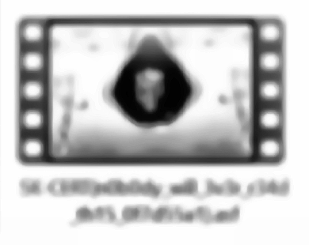
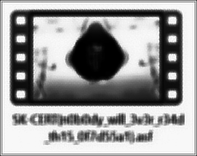

# Zadanie

EN: Greg sat in his lab, staring at a blurry screen recording someone sent him without context. As a forensic analyst, he was used to piecing together distorted footage, but this one was almost useless—shaky, low resolution, and barely a few seconds long. He ran it through every tool he had, trying to stabilize and sharpen it. Slowly, vague movements took shape—someone doing something at a desk, maybe typing, maybe hiding something. Nothing was clear. But whoever sent it wanted Greg to figure it out. And they knew he couldn’t walk away.

SK: Greg sedel vo svojom laboratóriu a civel na rozmazanú obrazovku s nahrávkou, ktorú mu niekto poslal bez kontextu. Ako forenzný analytik bol zvyknutý skladať skreslené zábery, ale tento bol takmer nepoužiteľný – roztrasený, s nízkym rozlíšením a sotva pár sekúnd dlhý. Prehnal ho všetkými nástrojmi, ktoré mal k dispozícii, a snažil sa ho stabilizovať a zaostriť. Pomaly sa formovali neurčité pohyby – niekto niečo robil za stolom, možno písal, možno niečo skrýval. Nič nebolo jasné. Ale ktokoľvek to poslal, chcel, aby Greg na to prišiel. A vedeli, že to nemôže nechať len tak.

**Súbory**

- f_conv.m4v

## Riešenie

Ako sa tak pozorne pozerám na video, tak vidím, že posúvaním okna sa mi javí SK-CERT v názve súboru, ktorý je na videu rozpixelovaný, takže úlohou bude zistiť názov súboru. 

Postup, ktorý napadol mne bol:

1. extrahovať frames (ale iba tie kde je vidieť vlajku a je tam pohyb oknom, cez POT Player vidím, že mi stačí frame 3930-4700)

2. vystrihnúť okno, ale tak, aby boli výstrižky čo najviac zarovnané

3. urobiť medián týchto výstrižkov


### Ako na to?

#### Bod 1:

Vytvorím si priečinok, napr. `outframes` a prejdem ffmpegom..

`mkdir outframes && ffmpeg -i f_conv.m4v -vf "select='between(n\,3930\,4700)'" -start_number 3930 -vsync 0 outframes/frame_%d.png`

##### Vyvetlenie argumentov:

- `-i f_conv.m4v` – vstupné video.

- `-vf "select='between(n\,3930\,4700)'"` – vyberie len framy s indexom medzi 3930 a 4700 (vrátane).
  
  - `n` je index frame-u (začína od 0).
- `-start_number 3930` číslovanie začneme práve od čísla 3930

- `-vsync 0` – zabráni opakovaniu/zlúčeniu framov (každý sa uloží ako obrázok).

- `outframes/frame_%d.png` – výstupná šablóna názvu súboru, 5-ciferné číslovanie, uložené do priečinka `outframes`.

#### Bod 2:

Mám jednotlivé frames ako obrázky. Teraz potrebujem zarovnať podľa nejakého statického bodu, resp miesta. Ja som si vzal prvý extragovaný frame (`frame_00001.png`) a vystrihol si obdĺžnik na ktorom je nikdy nerozpixelovaná časť ikony programu OBS-Studio... a podľa nej urobím výstrižky, ktoré budú obsahovať v ľavom hornom rohy vždy práve tento výstrižok, takže by mali +- pekne zarovnané. Ja som vystrihol 240x340px výstrižok s názvom snapper.png a od jeho 0x0 súradnice potrebujem cca 750x430 výstrižok, ktorý by mal byť zarovnaný podľa snappera. Na toto použijem python a knižnicu OpenCV.

```python
#!/usr/bin/env python3
# crop_snap.py

import cv2, os, argparse
from tqdm import tqdm

# ----------- CLI -----------
ap = argparse.ArgumentParser()
ap.add_argument('--framesdir', default='outframes', help='Priečinok s frame_1.png, frame_2.png ...')
ap.add_argument('--template', default='snapper.png', help='Šablóna, napr. snapper.png')
ap.add_argument('-o', '--out', default='cropped_frames')
ap.add_argument('--start', type=int, default=3930)
ap.add_argument('--end',   type=int, default=4680)
ap.add_argument('--step',  type=int, default=1)
ap.add_argument('--offset_x', type=int, default=360, help='Posun výrezu od X šablóny')
ap.add_argument('--offset_y', type=int, default=120, help='Posun výrezu od Y šablóny')
ap.add_argument('--w', type=int, default=390, help='Šírka výrezu')
ap.add_argument('--h', type=int, default=310, help='Výška výrezu')
ap.add_argument('--min_sim', type=float, default=0.99, help='0-1, 1=perfektná zhoda')
ap.add_argument('--pad_zeros', type=int, default=0, help='Počet núl vo formáte frame_0001.png (0=bez núl)')
args = ap.parse_args()
os.makedirs(args.out, exist_ok=True)

# ----------- načítanie šablóny -----------
T_orig = cv2.imread(args.template, cv2.IMREAD_GRAYSCALE)
if T_orig is None:
    raise RuntimeError('Šablónu neviem načítať')
Th0, Tw0 = T_orig.shape[:2]

# ----------- multiscale match -----------
def match_multi(frame_gray, T):
    best, best_loc, best_size = -1, (0, 0), (Tw0, Th0)
    for s in (0.4, 0.5, 0.6, 0.8, 1.0, 1.2):
        Tw, Th = int(Tw0*s), int(Th0*s)
        if Tw < 25 or Th < 25:
            continue
        T_s = cv2.resize(T, (Tw, Th), interpolation=cv2.INTER_AREA)
        res  = cv2.matchTemplate(frame_gray, T_s, cv2.TM_SQDIFF_NORMED)
        minVal, _, minLoc, _ = cv2.minMaxLoc(res)
        score = 1.0 - minVal
        if score > best:
            best, best_loc, best_size = score, minLoc, (Tw, Th)
    return best, best_loc, best_size

skipped = []
for n in tqdm(range(args.start, args.end+1, args.step)):
    # Podpora pad_zeros v názvoch
    if args.pad_zeros > 0:
        iname = os.path.join(args.framesdir, f'frame_{n:0{args.pad_zeros}d}.png')
    else:
        iname = os.path.join(args.framesdir, f'frame_{n}.png')
    frame = cv2.imread(iname)
    if frame is None:
        skipped.append(n)
        continue

    gray = cv2.cvtColor(frame, cv2.COLOR_BGR2GRAY)
    score, (x, y), (Tw, Th) = match_multi(gray, T_orig)

    if score < args.min_sim:
        skipped.append(n)
        continue

    crop_x = x + args.offset_x
    crop_y = y + args.offset_y

    # Kontrola hraníc
    H, W = frame.shape[:2]
    if (crop_x < 0) or (crop_y < 0) or (crop_x+args.w > W) or (crop_y+args.h > H):
        skipped.append(n)
        continue

    crop = frame[crop_y : crop_y+args.h, crop_x : crop_x+args.w]

    if crop.shape[0] != args.h or crop.shape[1] != args.w:
        skipped.append(n)
        continue

    cv2.imwrite(f'{args.out}/f{n:05d}.png', crop)

print(f'[✓] hotovo - uložené {len(range(args.start,args.end+1,args.step))-len(skipped)} snímok v “{args.out}”')
print('[i] preskočené framy:', len(skipped))
if skipped:
    print('   ', skipped[:15], '...')


```

Spustíme príkaz `python3 crop_snap.py` počkáme pár minút a v priečinku `cropped_frames` máme orezané a zarovnané frames čisto s mozaikovou (pixelated) časťou, ktorá nás zaujíma.

Čo s nimi ďalej?

### Bod 3:

Z pripravených orezaných a zarovnaných frame-ov teraz urobíme medián a prípadne nejaké magics (doostrenie + kontrast a este doostrenie pomocou Richardson_Lucy dekonvolúcie)

```python
import glob, cv2, numpy as np
from tqdm import tqdm
import os
from skimage import restoration, img_as_ubyte

IN_DIR   = 'cropped_frames'
OUT_IMG  = 'cropped_frames_median_sharp.png' 
ALIGN    = False                # zarovnávať jednotlivé framy? už máme! ale keby niekto chcel.

# ───── 1) načítanie všetkých framov ───────────────────────────────────────
files = sorted(glob.glob(os.path.join(IN_DIR, '*.png')))
if not files:
    raise SystemExit('V adresári “crops/” som nenašiel žiadne PNG.')

imgs = [cv2.imread(f, cv2.IMREAD_GRAYSCALE) for f in files]
h, w  = imgs[0].shape[:2]
print(f'[i] načítaných {len(imgs)} snímok, veľkosť {w}×{h}')

# ───── 2) voliteľné zarovnanie (len posun x,y) ────────────────────────────
if ALIGN:
    ref = imgs[0].astype(np.float32)
    aligned = []
    for im in tqdm(imgs, desc='align'):
        shift, _ = cv2.phaseCorrelate(ref, im.astype(np.float32))
        dx, dy   = shift            # note: (x,y) poradie
        M        = np.float32([[1,0,-dx], [0,1,-dy]])
        warp     = cv2.warpAffine(im, M, (w, h),
                                  flags=cv2.INTER_LINEAR,
                                  borderMode=cv2.BORDER_REPLICATE)
        aligned.append(warp)
    stack = np.stack(aligned, axis=0)
else:
    stack = np.stack(imgs, axis=0)

# ───── 3) median-stack ────────────────────────────────────────────────────
median = np.median(stack, axis=0).astype(np.uint8)
cv2.imwrite('cropped_frames_median_raw.png', median)
print('[✓] výsledok uložený ako cropped_frames_median_raw.png')

# ───── 4) doostrenie + kontrast (CLAHE) ───────────────────────────────────
clahe  = cv2.createCLAHE(clipLimit=2.0, tileGridSize=(8,8))
eq     = clahe.apply(median)

blur   = cv2.GaussianBlur(eq, (3,3), 0)
sharp  = cv2.addWeighted(eq, 1.6, blur, -0.6, 0)

cv2.imwrite(OUT_IMG, sharp)
print(f'[✓] výsledok uložený ako {OUT_IMG}')

# ───── 6) doostrenie pomocou Richardson-Lucy dekonvolúcie ─────────────────
img  = cv2.imread(OUT_IMG, 0).astype(np.float32) / 255.0

# PSF – 9×9 gauss, σ≈3.6
k = cv2.getGaussianKernel(27, 3.6)
psf = k @ k.T
deconv = restoration.richardson_lucy(img, psf, num_iter=50, clip=False)

out = img_as_ubyte(np.clip(deconv, 0, 1))
cv2.imwrite('cropped_frames_median_sharp_rl.png', out)
print('[✓] výsledok uložený ako cropped_frames_median_sharp_rl.png')
```

Z othto dostanem tri obrazky, raw, sharped a rl.

```
[i] načítaných 751 snímok, veľkosť 390×310
[✓] výsledok uložený ako cropped_frames_median_raw.png
[✓] výsledok uložený ako cropped_frames_median_sharp.png
[✓] výsledok uložený ako cropped_frames_median_sharp_rl.png
```





Prípadne som našiel ešte KoKuToru repo na githube, ktoré vie pracovať z mozaikou https://github.com/KoKuToru/de-pixelate_gaV-O6NPWr

Mierne upravený skript pre naše potreby:

```python
import os
import torch
from PIL import Image
import torch.nn.functional as F
from torchvision import transforms

mosaic_size = (268/31, 337/39) # y,x

frames_dir = 'cropped_frames'
mosaics_dir = 'mosaics'
accumulated_dir = 'accumulated'

os.makedirs(mosaics_dir, exist_ok=True)
os.makedirs(accumulated_dir, exist_ok=True)

to_tensor = transforms.ToTensor()
to_pil = transforms.ToPILImage()

def load_png_frames(frames_folder):
    for filename in sorted(os.listdir(frames_folder)):
        if filename.lower().endswith(".png"):
            filepath = os.path.join(frames_folder, filename)
            try:
                image = Image.open(filepath).convert("RGBA")
                img = to_tensor(image).mul(0xFF).to(torch.uint8)
                yield filename, img
            except Exception as e:
                print(f"Error processing {filename}: {e}")

gframe = None

for name, frame in load_png_frames(frames_dir):
    # ----- DEMOSAIC -----
    # Nájde hrany mozaiky (zmena intenzity v horizontálnom/vertikálnom smere)
    hframe = frame.float().mean(-1, keepdim=True)
    vframe = frame.float().mean(-2, keepdim=True)
    mframe = (hframe.expand_as(frame) + vframe.expand_as(frame)).div(2)
    hframe2 = (mframe[:, :-1, :-1] - mframe[:, 1:, :-1]).abs().mean(0, keepdim=True)
    vframe2 = (mframe[:, :-1, :-1] - mframe[:, :-1, 1:]).abs().mean(0, keepdim=True)
    hframe2 = hframe2 > 4
    vframe2 = vframe2 > 4

    # Hľadanie offsetu mozaiky
    for y in range(9, hframe2.size(-2) - 9):
        if hframe2[0, y, 50]:
            break
    else:
        y = 9
    for x in range(9, vframe2.size(-1) - 9):
        if vframe2[0, 50, x]:
            break
    else:
        x = 9

    mosaic_y = int(y + 1)
    mosaic_x = int(x + 1)
    while mosaic_y - mosaic_size[-2] > 0:
        mosaic_y -= mosaic_size[-2]
    while mosaic_x - mosaic_size[-1] > 0:
        mosaic_x -= mosaic_size[-1]
    print(f"{name} Mosaic offset found at (x={mosaic_x}, y={mosaic_y})")

    # Vykreslenie hrán mozaiky do obrázka (červená-zelená mriežka)
    mframe2 = hframe2 | vframe2
    mframe2 = F.pad(mframe2, (0, 1, 1, 0))
    mframe = mframe.to(torch.uint8)
    mframe2[:, :9] = 0
    mframe2[:, -9:] = 0
    mframe2[:, :, :9] = 0
    mframe2[:, :, -9:] = 0
    mframe = torch.where(
        mframe2.expand_as(mframe),
        torch.tensor((0, 0, 0xFF, 0xFF), dtype=torch.uint8).view(4, 1, 1).expand_as(mframe),
        frame
    )

    # Pripravenie masky pre akumuláciu
    mask = torch.zeros_like(frame, dtype=float)
    y = mosaic_y + mosaic_size[-2] / 2
    while y < hframe2.size(-2):
        x = mosaic_x + mosaic_size[-1] / 2
        while x < vframe2.size(-1):
            x_int = int(x)
            y_int = int(y)
            mask[:, y_int, x_int] = 1
            mframe[0, y_int, x_int] = 0
            mframe[1, y_int, x_int] = 0xFF
            mframe[2, y_int, x_int] = 0
            mframe[3, y_int, x_int] = 0xFF
            x += mosaic_size[-1]
        y += mosaic_size[-2]

    # Ulož mozaikový obrázok s mriežkou
    mosaic_img = to_pil(mframe)
    mosaic_img.save(os.path.join(mosaics_dir, name))

    # Akumulácia pixelov na daných pozíciách
    if gframe is None:
        gframe = torch.zeros_like(frame, dtype=float)
    gframe += frame * mask

    # "Grow" pixely (vyplní chýbajúce priečky z priemeru okolia)
    image = torch.zeros_like(gframe)
    image[:] = gframe
    run = True
    while run:
        c = image[3:4] == 0
        run = torch.any(c)
        image += c.float() * F.avg_pool2d(image, 3, 1, 1, False, False, 1)

    image = image.div(image[3:4]).mul(0xFF)
    image = image.to(torch.uint8)
    result_img = to_pil(image)
    result_img.save(os.path.join(accumulated_dir, name))

```

Pozlený obrázok, ktorý z toho vyliezol a jeho variácie po RL dekonvolúcii a pohraním sa z Channel curves vo Photovea webovom nástroji (web klon photoshopu for free)




Dva dni som dokázal prečítať len `SK-CERT{nobody_will_3v3r_r34d_th15_xxxxxxxx}.asf` a hľadal som slová, ktoré by sa mohli podobať. A nakoniec to bol hex string `0f7d55a1`.


## Vlajka

    SK-CERT{n0b0dy_will_3v3r_r34d_th15_0f7d55a1}
