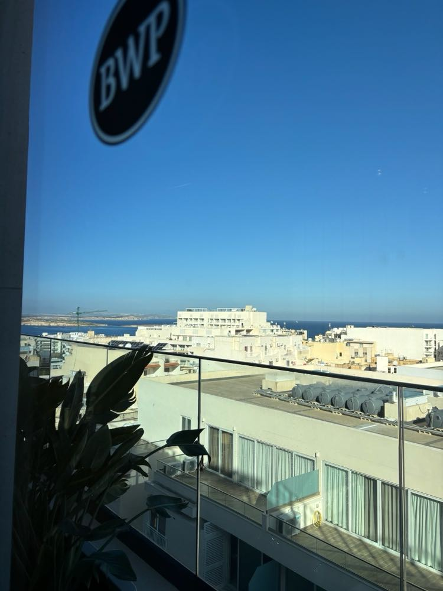

# Zadanie

EN: We received a tip about a dangerous individual who uses various false identities. Several agencies are working to obtain any new information that could help track down this person. A photograph has been obtained, allegedly taken by the suspect. Can we learn anything more from it?

SK: Dostali sme tip na nebezpečnú osobu, ktorá používa rôzne falošné identity. Niekoľko agentúr sa snaží získať akékoľvek nové informácie, ktoré by mohli pomôcť túto osobu vypátrať. Bola získaná fotografia, údajne odfotená podozrivým. Môžeme sa z nej dozvedieť ešte niečo ďalšie?

**Súbory**

- photo.jpg

## Riešenie




Na obrázku je vidieť logo BWP, nejakú dovolenkovú destináciu a Google Lens ma odporúčil na Hotel Best Western Premier Malta... Po prezretí pár používateľských recenzíí na internete s fotkami sa potvrdilo, že sa skutočne jednalo o tento hotel. 

Prešiel som všetky možné recezie, Otázky a odpovede, až som nakoniec našiel na tripadvisore recenziu na tento hotel od používateľa Jolaus z Kene, čo bolo podozrivé trochu, keďže tento rok je Cybergame aj v Keni. Po otvorení jeho používateľského profilu bola v sekcii o mne vlajka.

https://www.tripadvisor.co.uk/Profile/cybergameosintplayer

## Vlajka

```
SK-CERT{h0t31_r3vi3w_f14g}
```
