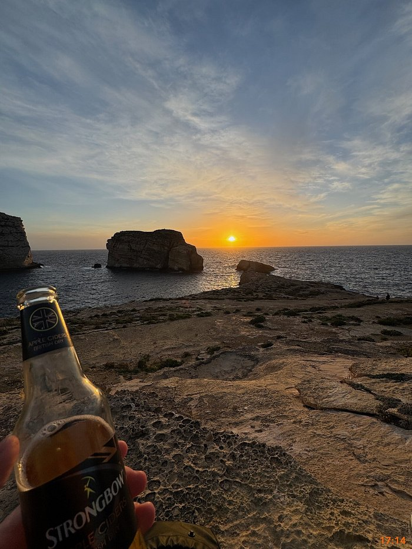

# Zadanie

EN: We have managed to identify the hotel and also a review that was allegedly posted by the wanted individual. The suspect then left the hotel and has been moving through unspecified locations. The only clue we currently have is a photograph posted on their profile on the TripAdvisor website.

Can we determine where the photo was taken? Specifically, we are interested in the exact coordinates of the location from which the photograph was captured.

The flag should be in the format: "Latitude,Longitude", with a precision of five decimal places.

Correct format example (without quotes):

- “27.98800,86.92505”

Incorrect format examples:

- “27.9880,86.92505” – missing decimal digit in latitude
- “27.98800, 86.92505” – space
- “27,98800,86.92505” – comma instead of a dot
- “27.988000, 86.92505” – more than five decimal places

SK: Podarilo sa nám identifikovať hotel a tiež recenziu, ktorú údajne napísala hľadaná osoba. Podozrivý potom opustil hotel a pohybuje sa cez neurčené lokality. Jedinou stopou, ktorú momentálne máme, je fotografia zverejnená na jeho profile na stránke TripAdvisor.

Dokážeme určiť, kde bola fotografia odfotená? Konkrétne nás zaujímajú presné súradnice miesta, z ktorého bola fotografia spravená.

Vlajka by mala byť vo formáte: "Latitude,Longitude", s presnosťou na päť desatinných miest.

Príklad správneho formátu (bez úvodzoviek):

- “27.98800,86.92505”

Príklady nesprávneho formátu:

- “27.9880,86.92505” – chýba jedna desatinná číslica v zemepisnej šírke
- “27.98800, 86.92505” – medzera
- “27,98800,86.92505” – čiarka namiesto bodky
- “27.988000, 86.92505” – viac ako päť desatinných miest

## Riešenie

V používateľskom profile z predošlej úlohy bola jedna fotografia 



Bolo veľmi náročné zistiť pozíciu vzhľadom na to, že tolerancia bola malá, ale podľa google sa jedná o Fungus Rock na Malte a na niekoľko desiatok pokusov sa podarilo získať správnu vlajku. V mojom prípade to bolo 36.04861,14.19114

## Vlajka

```
36.04861,14.19114
```
